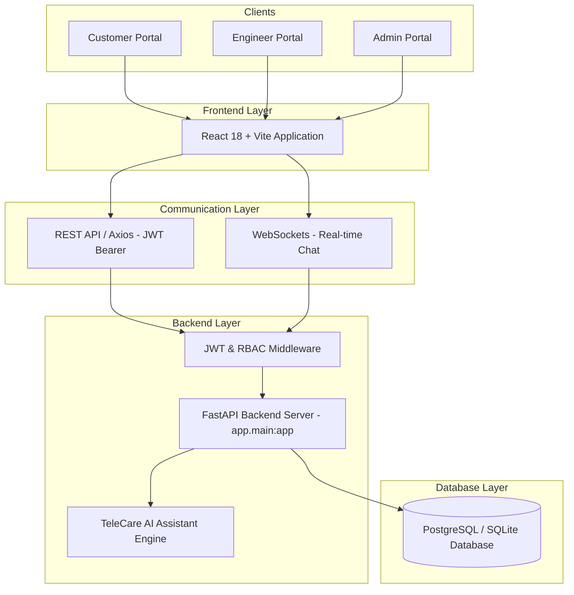

# TeleCare AI — SIM Customer Support Portal


TeleCare AI is a full-stack, SIM-focused web-based customer support platform. It allows telecom customers to raise SIM support tickets, interact with an AI assistant for instant troubleshooting, and escalate complex issues to human support engineers.

The platform provides separate role-based workflows for:
- **Customer**
- **Support Engineer**
- **Admin**

---

## 🌐 Live Production Deployment

- **Production Backend API**: [https://telecare-ai.onrender.com](https://telecare-ai.onrender.com)
- **Interactive Swagger Docs**: [https://telecare-ai.onrender.com/docs](https://telecare-ai.onrender.com/docs)
- **OpenAPI Schema**: [https://telecare-ai.onrender.com/openapi.json](https://telecare-ai.onrender.com/openapi.json)
- **Health Check**: [https://telecare-ai.onrender.com/health](https://telecare-ai.onrender.com/health)

---

## ✨ Features

### 👤 Customer
- **Authentication**: Registration, Login, and JWT Bearer token security.
- **Customer Dashboard**: Overview of personal tickets, quick actions, and status metrics.
- **Profile**: View and manage customer profile information.
- **Create SIM Support Ticket**: Pre-filled SIM category selection with validation.
- **Ticket Management**: View active tickets, track status progress, and open ticket details.
- **Notifications**: Real-time notifications for status updates and engineer notes.
- **TeleCare AI Assistant**: Instant 24/7 SIM troubleshooting assistant with action buttons.
- **Feedback & Rating**: Rate resolved tickets with 1 to 5-star ratings and written reviews.
- **Evidence Uploads**: Secure PNG, JPG, and PDF document/image attachment uploads.

### 🛠️ Support Engineer
- **Engineer Login**: Dedicated single sign-on access.
- **Engineer Dashboard**: View assigned tickets filtered dynamically by backend RBAC authorization.
- **Ticket Investigation**: View customer details, issue descriptions, and evidence attachments.
- **Status Updates**: Transition ticket statuses (`In Progress`, `Resolved`, `Closed`).
- **Internal Notes**: Record investigation notes for internal tracking and customer review.
- **Activity History**: View auto-generated ticket activity audit logs.

### 👑 Admin
- **Admin Login**: Enterprise administrative access.
- **Admin Dashboard**: System-wide ticket volume, workload breakdown, and status distribution.
- **User & Customer Management**: View customer registries and active engineers.
- **Engineer Assignment**: Assign unassigned tickets to support engineers.
- **System Analytics**: Real-time KPI stats, category distributions, monthly trends, and customer satisfaction metrics.

### 🤖 AI Assistant (SIM-Only Scope)
The **TeleCare AI Assistant** is an automated conversational agent specifically tailored for **SIM-related customer support**.

- **Supported SIM Topics**:
  - SIM card not working / No SIM signal
  - Lost or stolen SIM card (immediate block request)
  - Damaged or scratched SIM card
  - Physical SIM replacement requests
  - SIM activation troubleshooting
  - SIM blocked / PUK code guidance
  - eSIM installation & QR code profile issues
  - Mobile Number Portability (MNP)

- **Polite Non-SIM Scope Redirection**:  
  To maintain high support quality, non-SIM inquiries (Wi-Fi, router, broadband, fiber, weather, laptop, or printer support) are politely redirected:
  > *"Hi! I am your TeleCare AI Assistant. I specialize exclusively in SIM-related support (SIM activation, replacement, lost/damaged SIMs, eSIM, PIN/PUK, and mobile network settings). For non-SIM services, please contact general support."*

### 🔘 AI Action Buttons
When a user reports critical issues such as `"I lost my SIM"`, the assistant generates distinct, interactive visual buttons:
- `[ Block Lost SIM ]` — Initiates immediate SIM block workflow.
- `[ Request Replacement ]` — Directs customer to ticket creation with pre-filled category.
- `[ Contact Support Engineer ]` — Escalates request directly to a support engineer.

---

## 🛠️ Technology Stack

### Frontend
- **Framework**: React 18
- **Build Tool**: Vite
- **Language**: JavaScript (ES6+)
- **Styling**: Vanilla CSS & Tailwind CSS (Custom Dark Telecom Theme)
- **HTTP Client**: Axios (with JWT interceptors)

### Backend
- **Language**: Python 3.10+
- **Framework**: FastAPI
- **ORM**: SQLAlchemy
- **Database**: PostgreSQL (Production) / SQLite (Local Development)
- **Authentication**: PyJWT (HS256) & Passlib (`pbkdf2_sha256`)
- **Real-Time**: WebSockets (`websockets`)

### Deployment
- **Platform**: Render (Cloud Web Service)

---

## 🏗️ System Architecture



---

## 🔌 API Endpoint Summary

### Authentication (`/api/auth`)
- `POST /api/auth/register` — Register a new customer account.
- `POST /api/auth/login` — Authenticate and obtain JWT Bearer access token.
- `POST /api/auth/otp/send` — Send email OTP code.
- `POST /api/auth/otp/verify` — Verify OTP code and auto-register.
- `POST /api/auth/forgot` — Request password reset code.
- `POST /api/auth/reset` — Reset password using OTP code.

### Users (`/api/users`)
- `GET /api/users/me` — Retrieve current authenticated user profile.
- `PUT /api/users/me` — Update user profile details.
- `GET /api/users` — List all registered users (Admin only).
- `GET /api/users/customers` — List registered customers (Admin only).

### Tickets (`/api/tickets`)
- `POST /api/tickets` — Create a new SIM support ticket.
- `GET /api/tickets` — List support tickets (Filtered by role).
- `GET /api/tickets/{id}` — Retrieve detailed ticket information.
- `PUT /api/tickets/{id}` — Update ticket details.
- `DELETE /api/tickets/{id}` — Delete a ticket (Admin only).
- `PUT /api/tickets/{id}/assign` — Assign engineer to ticket (Admin/Engineer).
- `PUT /api/tickets/{id}/status` — Update ticket status (`Open`, `In Progress`, `Resolved`, `Closed`).
- `PUT /api/tickets/{id}/close` — Close a ticket.
- `GET /api/tickets/{id}/activities` — Retrieve ticket activity audit history.
- `PUT /api/tickets/{id}/notes` — Add/update engineer investigation notes.

### Chat (`/api/chat`)
- `POST /api/chat/send` — Send ticket chat message (Triggers automated AI reply for customers).
- `GET /api/chat/history/{ticket_id}` — Retrieve chat history for a ticket.
- `WS /api/chat/ws/{ticket_id}` — Real-time WebSocket chat stream.

### Feedback (`/api/feedback`)
- `POST /api/feedback` — Submit rating feedback for a resolved ticket.
- `GET /api/feedback` — Retrieve all customer feedback.
- `GET /api/feedback/{ticket_id}` — Retrieve feedback for a specific ticket.

### Analytics (`/api/analytics`)
- `GET /api/analytics/stats` — Overall system KPI statistics.
- `GET /api/analytics/category-report` — Category distribution breakdown.
- `GET /api/analytics/monthly-report` — Monthly ticket volume trends.
- `GET /api/analytics/engineer-performance` — Engineer resolution metrics.
- `GET /api/analytics/customer-satisfaction` — Customer satisfaction rating reports.

### Attachments (`/api/tickets/.../attachments`)
- `POST /api/tickets/{ticket_id}/attachments` — Upload image/PDF evidence file.
- `GET /api/tickets/{ticket_id}/attachments` — List attachments for a ticket.
- `GET /api/tickets/attachments/{attachment_id}/download` — Secure attachment download.
- `DELETE /api/tickets/attachments/{attachment_id}` — Delete an attachment.

### Notifications (`/api/notifications`)
- `GET /api/notifications` — List user notifications.
- `PUT /api/notifications/{notification_id}/read` — Mark notification as read.
- `PUT /api/notifications/read-all` — Mark all notifications as read.

### Health Check (`/health`)
- `GET /health` — Returns `HTTP 200 OK` (`{"status": "healthy", "service": "TeleCare-AI"}`).

---

## 🔐 Authentication & Security

- **JWT Bearer Token Authentication**: Standard header-based token authentication with configurable expiration.
- **Role-Based Access Control (RBAC)**: Backend dependencies enforce strict access control (`Customer`, `Engineer`, `Admin`).
- **Protected Routes**: Client-side route guards prevent unauthorized navigation.
- **Input & File Attachment Protection**: Extension checking (`.png`, `.jpg`, `.jpeg`, `.pdf`), UUID file naming, and `os.path.realpath` path traversal protection.
- **Environment Isolation**: Private credentials, database connection strings, and secret keys managed strictly via environment variables.

---

## 🗄️ Database

The production application is configured to connect to a **PostgreSQL** database managed via SQLAlchemy ORM.

- **Production Database**: Managed PostgreSQL on Render via environment variable `DATABASE_URL`.
- **Automatic Compatibility**: Automatic conversion of legacy `postgres://` URIs to `postgresql://` for SQLAlchemy 2.0+ compatibility.
- **Auto-Seeding**: Initial database startup auto-seeds default roles (`admin`, `engineer`, `customer`) for testing.

---

## 🚀 Render Deployment Setup

The backend is deployed as a Web Service on **Render**:

- **Production URL**: `https://telecare-ai.onrender.com`
- **Root Directory**: `backend`
- **Build Command**: `pip install -r requirements.txt`
- **Start Command**: `uvicorn app.main:app --host 0.0.0.0 --port $PORT`
- **Health Check Path**: `/health`

---

## ⚙️ Local Development Setup

### 1. Backend Setup

```bash
# Navigate to backend directory
cd backend

# Create virtual environment
python -m venv venv

# Activate virtual environment
# Windows:
.\venv\Scripts\activate
# macOS/Linux:
source venv/bin/activate

# Install requirements
pip install -r requirements.txt

# Create local environment configuration
cp .env.example .env

# Start FastAPI backend server
uvicorn app.main:app --reload
```

### 2. Frontend Setup

```bash
# Open a new terminal and navigate to frontend directory
cd ai-support-system-frontend

# Install dependencies
npm install

# Start Vite development server
npm run dev
```

---

## 🔑 Environment Variables Configuration

Create a `.env` file in `backend/` using the following environment variable names:

```env
DATABASE_URL=
JWT_SECRET_KEY=
ALGORITHM=HS256
ACCESS_TOKEN_EXPIRE_MINUTES=60
CORS_ORIGINS=
EMAIL_ADDRESS=
EMAIL_PASSWORD=
SMTP_SERVER=
SMTP_PORT=
```

---

## 📂 Project Structure

```text
AI-Telecom-Customer-Support-Portal/
│
├── ai-support-system-frontend/     # React 18 + Vite Frontend Application
│   ├── public/                     # Static icons and assets
│   ├── src/                        # React components, pages, context & services
│   │   ├── components/             # Reusable UI cards, buttons, navbar & chat window
│   │   ├── context/                # AuthContext & state providers
│   │   ├── pages/                  # Customer, Engineer, Admin, and Auth pages
│   │   ├── services/               # Axios httpClient, API services, AI engine
│   │   ├── App.jsx                 # Router configuration
│   │   └── main.jsx                # React entry point
│   ├── package.json                # Dependencies and build scripts
│   └── vite.config.js              # Vite build configuration
│
├── backend/                        # FastAPI Backend Application
│   ├── app/                        # Application core
│   │   ├── api/                    # API Routers (auth, users, tickets, chat, feedback, analytics)
│   │   ├── auth/                   # JWT handler, password hashing & dependencies
│   │   ├── config/                 # Pydantic settings configuration
│   │   ├── database/               # SQLAlchemy session & base models
│   │   ├── models/                 # ORM Models (User, Ticket, ChatMessage, Attachment, Feedback)
│   │   ├── schemas/                # Pydantic validation schemas
│   │   └── services/               # Email service helper
│   ├── tests/                      # Pytest automated test suite
│   ├── uploads/                    # Ticket file attachments directory (.gitkeep)
│   ├── .env.example                # Safe environment variable template
│   ├── main.py                     # FastAPI entry point & database seeder
│   └── requirements.txt            # Python dependencies
│
├── docs/                           # Documentation assets and screenshots
├── .gitignore                      # Git exclusion rules
├── LICENSE                         # MIT License
└── README.md                       # Project documentation
```

---

## 👥 Team Contributions

| Member | Role | Responsibilities & Key Contributions |
| :--- | :--- | :--- |
| **Katta Durga Sharan Teja** | Backend Developer | Developed FastAPI backend, REST APIs, PostgreSQL database integration, JWT authentication, Role-Based Access Control (RBAC), ticket management APIs, engineer assignment workflows, file attachment security, analytics APIs, backend deployment on Render, and testing. |
| **Kanuri Yaswanth Kumar** | Frontend Developer | Built React/Vite frontend, Customer Portal, Engineer Portal, Admin Portal, UI/UX design system, dark telecom layout, responsive components, and frontend API integration. |
| **Baddireddi Satya Vinay** | AI & Integration Engineer | Designed TeleCare AI Assistant, SIM-only support logic, conversational fallback handling, frontend-backend API integration, end-to-end workflow testing, debugging, and validation. |

---

## 🧪 Production Acceptance Test Results

The full application underwent a comprehensive **Final Production Acceptance Test** against the live production deployment (`https://telecare-ai.onrender.com`), achieving a **100% PASS rate**:

- **Authentication**: `PASS` (JWT Bearer tokens generated and verified).
- **Customer Dashboard**: `PASS` (Ticket list, metrics, and profile loading).
- **Ticket Creation**: `PASS` (SIM tickets created with `HTTP 201`; invalid categories rejected with `HTTP 400`).
- **Ticket Lifecycle**: `PASS` (Complete Open → In Progress → Resolved → Feedback lifecycle verified).
- **Admin Workflow**: `PASS` (User listings and engineer assignment verified).
- **Engineer Workflow**: `PASS` (Assigned tickets visible; status updates & investigation notes saved).
- **AI Assistant**: `PASS` (SIM troubleshooting & polite non-SIM query redirection verified).
- **AI Action Buttons**: `PASS` (Interactive action buttons render and execute workflows).
- **WebSocket Messaging**: `PASS` (`wss://` protocol stream with automatic REST polling fallback).
- **Network Audit**: `PASS` (Zero production calls to local development addresses).
- **Browser Console**: `PASS` (0 JavaScript runtime errors; 2,444 modules compiled cleanly).
- **Responsive UI**: `PASS` (Tested desktop, tablet, and mobile layouts).
- **RBAC**: `PASS` (Customers blocked from admin routes with `HTTP 403 Forbidden`).
- **Backend Health**: `PASS` (`/health` returns `HTTP 200 OK` with `{"status":"healthy","service":"TeleCare-AI"}`).
- **Production Build**: `PASS` (`npm run build` status 0).

---

## 🎥 Recommended Demo Walkthrough

Follow this 2–3 minute workflow to demonstrate the full application:

1. **Sign In as Customer**: Log in using `customer` / `customerpassword` at `/`.
2. **Open Customer Dashboard**: View active ticket summary and click **"+ Create Support Ticket"**.
3. **Launch AI Assistant**: Open **"Ask AI Support"** (`/dashboard/chat`), type `"I lost my SIM"`, and observe automated guidance and formatted action buttons.
4. **Click Action Button**: Click **"Request Replacement"** to open ticket creation with pre-filled category.
5. **Create Support Ticket**: Submit a ticket with Title `"SIM has no signal"`, Category `"SIM Not Working"`, Priority `"High"`.
6. **Sign In as Admin**: Log out and sign in as `admin` / `adminpassword`.
7. **Assign Engineer**: Open **Admin Tickets** (`/admin/tickets`), locate the new unassigned ticket, click **"Assign Ticket"**, select `engineer`, and confirm.
8. **Sign In as Engineer**: Log out and sign in as `engineer` / `engineerpassword`.
9. **Engineer Resolution**: Open **Engineer Dashboard** (`/engineer/dashboard`), open the assigned ticket, add investigation notes, and set status to **"Resolved"**.
10. **Customer Feedback**: Log back in as `customer`, open the resolved ticket, and submit a 5-star rating review.
11. **Admin Analytics**: Log in as `admin` and open **Analytics** (`/admin/analytics`) to observe updated ticket resolution charts and rating distributions.

---

## 📸 Screenshots

Application screenshots demonstrate each user portal and workflow:

- **Login Screen**: Universal Multi-Role Single Sign-On (`/`)
- **Customer Portal**: Dashboard, Ticket Creation, My Tickets, AI Assistant, Profile
- **Admin Portal**: Admin Dashboard, Engineer Assignment, User Management, Analytics
- **Engineer Portal**: Engineer Dashboard, Assigned Tickets, Investigation Notes

*(Screenshots can be added to the `docs/screenshots/` directory)*

---

## 📄 License

This project is licensed under the MIT License — see the [LICENSE](LICENSE) file for details.
