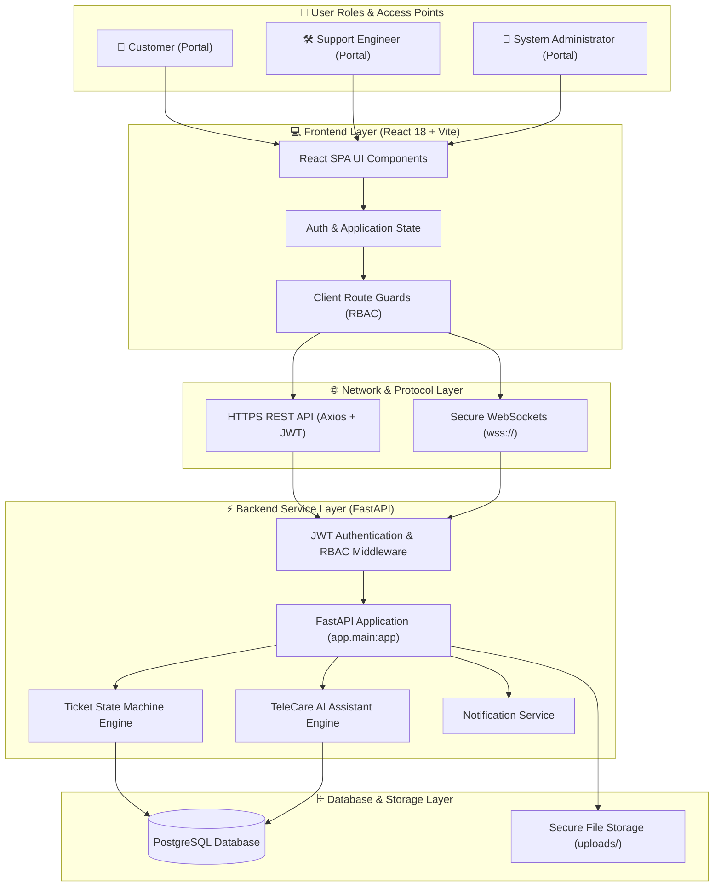
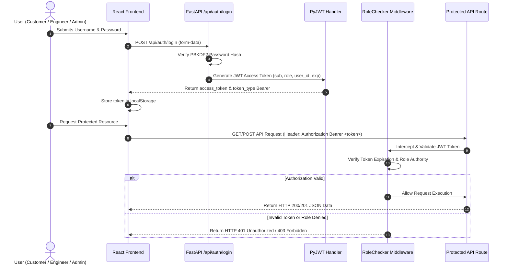
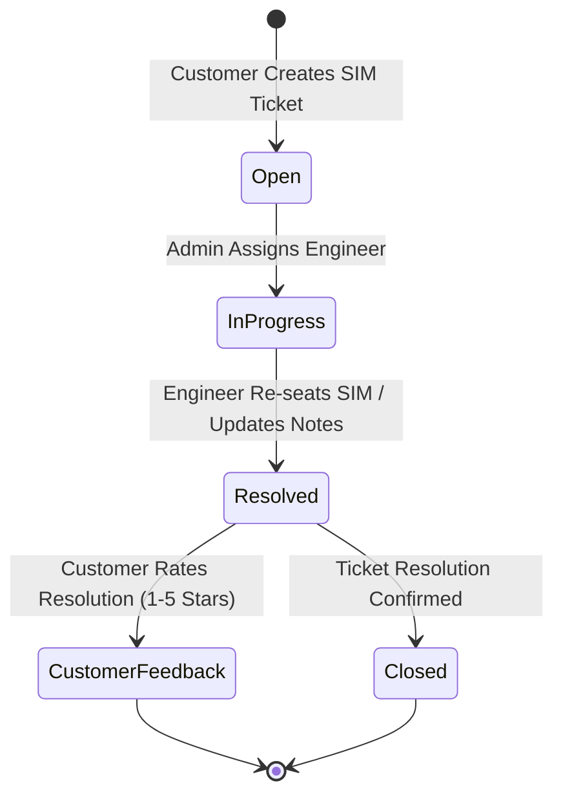
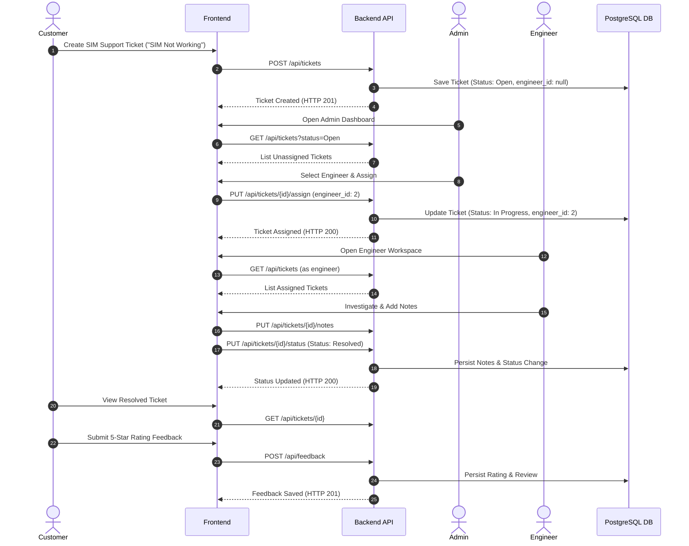
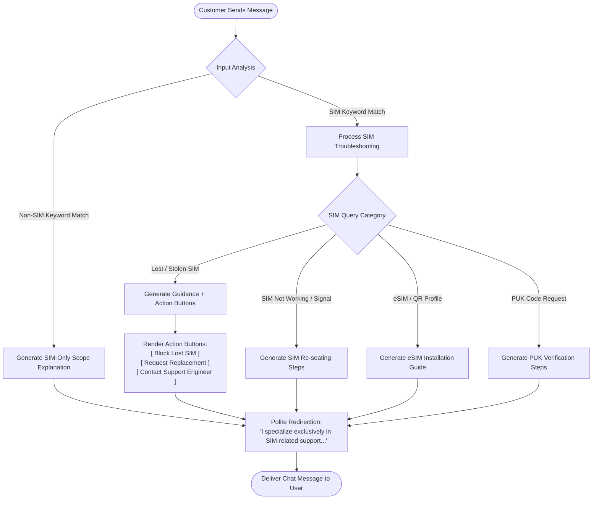
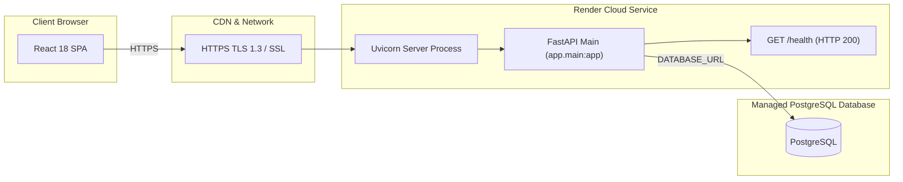

# 🏗️ TeleCare AI — Architecture Documentation

This document provides a detailed overview of the system architecture, component data flow, security model, database schema, AI assistant workflow, and production deployment topology for **TeleCare AI — SIM Customer Support Portal**.

---

## 🏛️ High-Level System Architecture

The following Mermaid diagram represents the overall system architecture and key interaction boundaries:

---

## 🔒 Authentication & Role-Based Access Control (RBAC) Flow

Authentication is managed using OAuth2 with JWT (JSON Web Tokens) signed via HMAC-SHA256 (`HS256`).

---

## 🎫 Ticket Lifecycle & Escalation Workflow

The ticket lifecycle follows a strict state-machine progression ensuring audit trail logging at every state transition:

### End-to-End Sequence

---

## 🤖 TeleCare AI Assistant Workflow

The **TeleCare AI Assistant** provides automated SIM guidance and interactive action buttons while maintaining strict domain scoping:

---

## 🌐 Production Deployment Topology

The application is deployed on **Render** cloud platform with secure environment isolation:

### Production Service Parameters

- **Service Type**: Render Web Service
- **Root Directory**: `backend`
- **Build Command**: `pip install -r requirements.txt`
- **Start Command**: `uvicorn app.main:app --host 0.0.0.0 --port $PORT`
- **Health Check Path**: `/health`
- **Production Base URL**: `https://telecare-ai.onrender.com`
- **Interactive OpenAPI Documentation**: `https://telecare-ai.onrender.com/docs`

---

## 📂 Core Component Responsibilities

### 1. Frontend (`ai-support-system-frontend`)
- **Single Page Application (SPA)** built with React 18 and Vite.
- Manages local authentication state, JWT storage, and `Authorization` header injection.
- Provides client-side role guards (`/dashboard`, `/engineer/dashboard`, `/admin/dashboard`).
- Renders responsive telecom dark mode interfaces, real-time WebSocket chat windows, and analytics dashboards.

### 2. Backend (`backend/app`)
- **FastAPI Engine** handling REST API routing, Pydantic validation, and dependency injection.
- **Security Services**: Password hashing via `pbkdf2_sha256`, JWT creation/decoding, and `RoleChecker` authorization.
- **Ticket Engine**: Manages ticket creation, assignment, status state changes, and automated audit activity logging.
- **AI Chat Engine**: Evaluates incoming customer inquiries, generates domain-specific SIM guidance, and powers action buttons.

### 3. Database Layer (`PostgreSQL`)
- **SQLAlchemy ORM** models:
  - `User`: Accounts, credentials, roles (`customer`, `engineer`, `admin`), and login audit timestamps.
  - `Ticket`: SIM support tickets, categories, priorities, statuses, customer/engineer relationships, and diagnostic notes.
  - `ChatMessage`: Ticket message history and AI assistant responses.
  - `Attachment`: Metadata for uploaded file evidence (`.png`, `.jpg`, `.pdf`).
  - `Feedback`: Customer resolution rating reviews (1 to 5 stars).
  - `TicketActivity`: Automated ticket audit log records.
